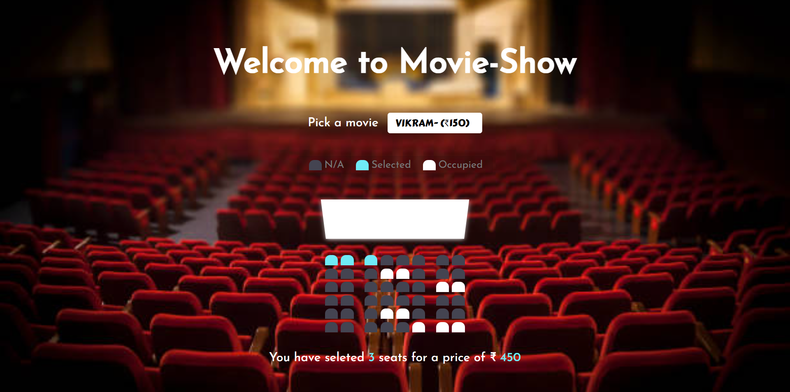

# Movie Ticket Booking Website 

`Author:` Padmanabh Belavadi

This is the project based on the idea of `Booking Movie shows`.
in this website, we can select the movie and select the seat position that how much required, based on requirement of seats it shows how many seats are selected and what is the total price to pay. `This is build purely on HTML,CSS and Javascript`.
__all the selected seats and payable amount information is strored in localstorage__

## My Project Looks Like :

## Reach Me Out on

 [Linkedin](https://www.linkedin.com/in/padmanabh-belavadi)

 [GitHub](https://github.com/padmanabh-b)

 [Instagram](https://www.instagram.com/legend_padmanabh/)

 [Findcoder](https://www.findcoder.io/u/padmanabh_b)

## Deployed Link
[Book My Ticket](https://paddu-movie-booking.netlify.app/)
